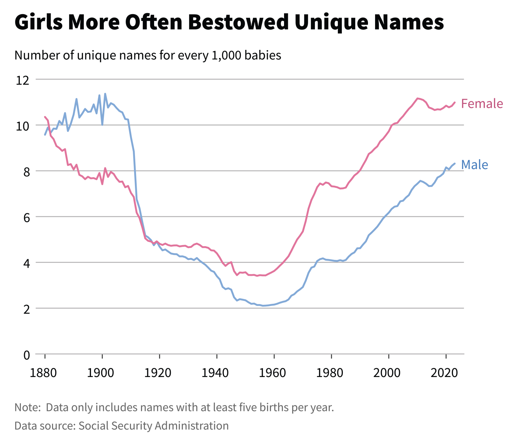

------------------------------------------------------------------------

---
title: "📝 HW1"
editor: 
  markdown: 
    wrap: sentence
format: 
  pdf
---

# STAT 131A, Fall 2026: HW1 Code

One of the biggest immediate impacts of large-language models (LLMs) on data science: **It's now a lot easier to write code to make plots.**

- Before ChatGPT, code to produce plots could take a long time to write. You often had to spend a lot of time reading extensive documentation and searching online forums for responses from analysts who tried to plot something similar.

- It could also take a lot of time to reshape and reformat the data to make it compatible with plotting functions.

LLMs can often write the code corresponding exactly or almost exactly to your **plain language description of a plot**.

- In other words, we can now spend more on the "what" and "why" of our plots, as opposed to the "how".

In light of this change, Stat 131a visualization questions have evolved. Rather than provide you with a written description of many plots and have you write code to reproduce them, we have flipped the script: **We want you to spend more time thinking about what you want to plot and why you should plot it.**

- While you will still write some plotting code in this assignment, we think it's important to recognize that many standard plot creation tasks can now be carried out by AI, so long as you provide **specific and clear instructions**.

- But, as you will see while working on this assignment, identifying and describing a plot can be a challenging task. It's an essential skill of a good data scientist.

Of course, we want to recognize that not everyone in the class feels comfortable using AI tools, and that is OK! **AI is not required for this assignment.**

- However, throughout this assignment, we will include tips for how to use AI productively for plotting tasks.

```{r}
# Run this cell load in required packages.

# If you choose to download RStudio/Positron, you will need to uncomment and run the following line of code a single time:
# install.packages('tidyverse')

library(tidyverse)
```

------------------------------------------------------------------------

# Question 1: Recreate an existing plot

Recall the `babynames` dataset from earlier in the course. In [**this article**](https://nightingaledvs.com/the-endless-stories-in-baby-name-data/), data journalist Emma Rubin reveals some interesting trends in baby names.

For example, Emma identified a steep decline in the share of babies with unique names in the first half of the 20th century, and a rapid resurgence in unique names since the 1960s:



**Your task**: Recreate this plot using the `babynames` dataset and `ggplot2`.

We're going to help you build this plot step-by-step. Make sure to run the code cell below.

```{r}
# Here is code that imports the babynames dataframe for you

# Location of the ZIP file containing the yearly baby-name data.
local_filename <- "data/names.zip"

# List the files in the archive and keep names like "yob2024.txt".
yearly_files <- unzip(local_filename, list = TRUE) |>
  pull(Name) |>
  str_subset("^yob[0-9]{4}\\.txt$")

# Read one year's data directly from the ZIP file.
read_year <- function(filename) {
  # Extract the year from the filename.
  year <- filename |>
    str_extract("\\d{4}") |>
    as.integer()

  # The files have no header row, so supply column names and types.
  # read_csv() opens and closes the connection into the archive itself.
  read_csv(
    unz(local_filename, filename),
    col_names = c("Name", "Sex", "Count"),
    col_types = cols(
      Name = col_character(),
      Sex = col_character(),
      Count = col_integer()
    )
  ) |>
    mutate(Year = year) |>
    select(Year, Name, Sex, Count)
}

# Read each yearly file, then combine the tables by stacking their rows.
babynames <- yearly_files |>
  map(read_year) |>
  list_rbind()

babynames
```

------------------------------------------------------------------------

### Question 1a

Run `View(babynames)` in the cell below.

Below, describe what each row contains. Be specific!

*Type your answer here, replacing this text.*


*AI Guidance:*

- You should not use AI to complete this question.

```{r}
# UNCOMMENT THE LINE BELOW AND RUN THIS CELL
# View(babynames)
```

------------------------------------------------------------------------

### Question 1b

Published plot for reference:


A helpful heuristic: In general, each "point" in a plot should correspond to one row of your plotted dataframe. See [tidy data](https://vita.had.co.nz/papers/tidy-data.pdf).

- For example, in the `babynames` plot above, one "point" represents the number of unique names per 1000 babies for **one possible combination of sex and year** in `babynames`.

Write a comment of the form "For each, ..., do ..." to generate the data necessary to produce this plot.

- Then, fill in the blanks with `dplyr` code that implements your comment.

- You can type `head(plot_df)` to preview the first few rows.

*AI Guidance:*

- Provide the LLM with your "For each ..., do ..." statement. Don't just ask it to write the code based on the problem description.

```{r}
# YOUR COMMENT HERE: For each ..., do ...

# UNCOMMENT THIS CODE AND FILL IN THE ...
# plot_df = babynames %>%
#   group_by(...) %>%
#   summarize(
#     ...
#   )

```

------------------------------------------------------------------------

### Question 1c

Published plot for reference:


Next, use `plot_df` to create a "baseline" version of the published plot with no additional formatting.

- Optional exploration: Change `geom_line()` to `geom_point()` or `geom_col()`. How are the plots related?

*AI Guidance:*

- Ask AI how to explain how to make a basic line plot with `ggplot2`. Then, ask how you would add color to it.

- Be sure to understand what goes inside `aes` and what it stands for.

```{r}
# UNCOMMENT THIS CODE AND FILL IN THE ...
# ggplot(data=plot_df, aes(x=..., y=..., color=...)) +
#   geom_line()

```

------------------------------------------------------------------------

### Question 1d

Published plot for reference:


It's time to format our plot!

Using Google or an LLM to help you, implement the key plot features that differ between your baseline plot and the published `babynames` plot above.

Your recreated plot does not need to be exactly the same as the published plot, but the substantive elements should be the same. Specifically, your plot should have the following:

- The same text (or lack thereof) in the title and axis labels.
- A white background.
- A written label of "male" and "female" somewhere above, below, on top of, or next to the corresponding line in the plot. **It is OK to hardcode positions of text.**
- No legend. For this plot, directly labeling lines is easier for the reader!

Here are some details you **do not** need to worry about (but, if you want a challenge, you are welcome to implement them):

- The caption.
- Fonts.
- The same style of gridlines. It's OK to have horizontal and vertical gridlines.
- Exactly the same numbers and scale along the axes. They just have to be similar.
- The size and resolution of the plot.
- The exact position and orientation of axis labels and data labels
- The exact matching of colors or shading
- The exact position of axis ticks near the edges of the plot

AI Guidance:

- If you decide to use an LLM to help you, questions like *"How do I add custom text to a plot in ggplot2?"* or *"How do I remove the legend of a ggplot2 plot?"* are appropriate to ask!

Here's the published plot for reference one more time:


```{r}
# UNCOMMENT THIS CODE AND FILL IN THE ...
# ggplot(data=plot_df, aes(x=..., y=..., color=...)) +
#   geom_line() +
#   ...

```

------------------------------------------------------------------------

# Question 2: Engaging with a plot from research

*Note: This is the same plot as the one you will present in a screencast!*

In their 2013 research paper titled [The Missing “One-Offs”: The Hidden Supply of High-Achieving, Low-Income Students](https://www.brookings.edu/wp-content/uploads/2016/07/2013a_hoxby.pdf), researchers Caroline Hoxby and Chris Avery investigate the behavior of high-achieving low-income applicants to undergraduate programs in the United States.

Hoxby and Avery define a "high-achieving" student as one who scores above the 90th percentile on the ACT or SAT **and** has an average high school GPA corresponding to an A- or higher. They define "low-income" as a family income in the bottom quartile, "upper-income" as the upper quartile, and "middle-income" as those who fall between.

Hoxby and Avery track the college applications of all high school students who graduated in 2008 and took either the ACT or SAT.

To keep everything on the same scale, Hoxby and Avery converted all ACT and SAT scores to percentiles.

- For example, a student who scored 1730/2400 on the SAT in 2008 was in the 75th percentile of SAT test takers.

- A different student who scored 24/36 on the ACT was in the 75th percentile of ACT test takers.

- In the Hoxby and Avery study, **both of these students are assigned a percentile test score of 75.**

- Additionally, **if the average ACT score of all enrolled students at College X was 24 (or, equivalent, the average SAT was 1730), Hoxby and Avery assign College X a percentile score of 75.**

Below is Figure 10 of their paper.

- Each data point used in the plot represents one college application from one student. The data points are aggregated to make the histogram.

- **Note that these are overlaid (not stacked) histograms.**


------------------------------------------------------------------------

### Question 2a

Write a caption for this figure. Remember that a caption should not describe every detail in a plot, but it should provide the key takeaway(s). Your caption should be a few sentences.

**Hints:**

- To help you understand the horizontal axis, make sure to read the definition of percentile test score for a student versus a percentile test score for a college. These definitions are provided in the introduction to this question.

*Type your answer here, replacing this text.*


------------------------------------------------------------------------

### Question 2b

Before publication in a formal venue, such as an academic journal, researchers will sometimes release a working paper. Formal publication can take months or even years of back-and-forth editing. Working papers allow results to be disseminated more quickly.

Here is the same figure from the Hoxby and Avery [working paper](https://www.nber.org/system/files/working_papers/w18586/w18586.pdf), which was released about a year before the official published paper:


Published figure for comparison:


------------------------------------------------------------------------

### Question 2c, Part i

What are the most important changes you observe when comparing the figure from the working paper to the figure from the published paper?

- Be sure to list **at least three substantive changes**. In the next part, you'll briefly evaluate the impact of each change you list.

- Examples of non-substantive changes: "The image is smaller in the final plot" or "The figure number was changed from 9 to 10".

- You should describe each change as something that was done to the working paper version of the plot.

Note: We notice at least ten changes!

*Type your answer here, replacing this text.*


------------------------------------------------------------------------

### Question 2c, Part ii

For at least three changes you listed in part (c), describe the impact of the change on the audience's perception of the plot.

Do you think the change made the plot easier or harder to understand? Why?

*Type your answer here, replacing this text.*


------------------------------------------------------------------------

### Question 2d

List at least one change to the **published** figure (not the working paper figure!) that you think would improve the interpretation of the plot.

Then, describe the impact of your proposed change(s).

- Your change(s) should not require additional data or any substantive modification of the existing data.

Published figure for reference:


*Type your answer here, replacing this text.*

